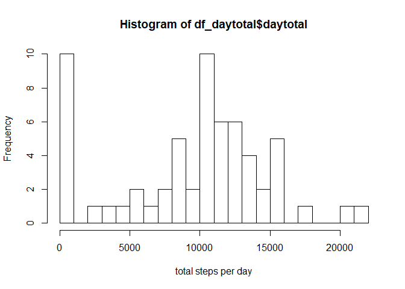
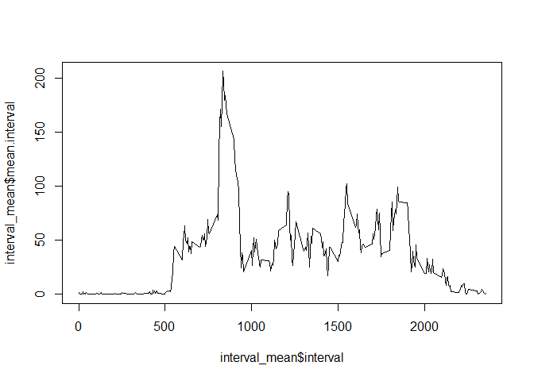
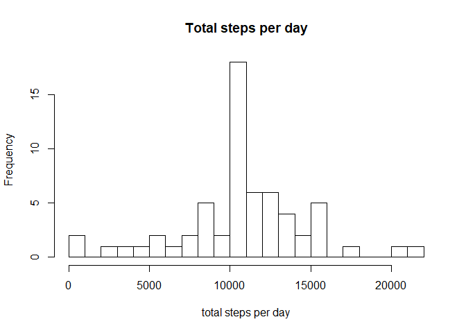
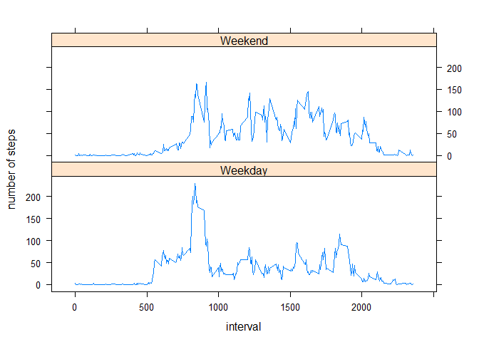

## Loading and preprocessing the data
Read the csv file, create a new column "date2" 


```r
library(dplyr)
library(lattice)
table1 <- read.csv("activity.csv")
table1$date2 <- as.Date(table1$date, "%Y-%m-%d")
```

## What is mean total number of steps taken per day?
calculate the sum of steps for each day using tapply with na removed, and plot the histogram


```r
daytotal <- tapply(table1$step, table1$date, sum, na.rm = T)
df_daytotal <- data.frame(daytotal)
hist(df_daytotal$daytotal, breaks = 20, xlab = "total steps per day")
```

<!-- -->

```r
#summary(df_daytotal$daytotal)
step_median <- median(df_daytotal$daytotal)
step_mean <- mean(df_daytotal$daytotal)
```
The median value of the total steps per day is 10395, and the mean value of the total steps per day is 9354.2295082

## What is the average daily activity pattern?

using pipline to group the data by interval, then calculate mean for each group. NA is removed.


```r
interval_mean <- table1 %>% group_by(interval) %>% summarise(mean.interval = mean(steps, na.rm = T))
plot(interval_mean$interval, interval_mean$mean.interval, type="l")
```

<!-- -->

```r
## get the interval with the max step value
max_interval <- interval_mean[interval_mean$mean.interval == max(interval_mean$mean.interval),]$interval
```

The interval 835, on average across all the days in the dataset, contains the maximum number of steps.

## Imputing missing values
To get the total number of NA

```r
numNA <- sum(is.na(table1$steps))
```
The total number of NA is 2304.

replace the NA with the mean value from the corresponding interval. For loop is used to iterate over each row, and check if the step is NA, if yes, the corresponding value is added.

```r
table2 <- cbind(table1)
for (n in seq(1, nrow(table2),1)) {
  if (is.na(table2[[n,"steps"]])) {
    table2[[n, "steps"]] <- interval_mean[interval_mean["interval"]==table2[[n,"interval"]],"mean.interval"][[1]]
  }
}
```
Use tapply function to calculate the sum for the new data frame

```r
daytotal <- tapply(table2$step, table2$date, sum)
df_daytotal2 <- data.frame(daytotal)
hist(df_daytotal2$daytotal, breaks = 20, xlab = "total steps per day")
```

<!-- -->

```r
step_median2 <- median(df_daytotal2$daytotal)
step_mean2 <- mean(df_daytotal2$daytotal)
```
The new median and new mean values of the total steps per day are 10766.19, and 10766.19.  

## Are there differences in activity patterns between weekdays and weekends?


```r
# create weekdayCheck for weekday and weekend
table2$weekday <- weekdays(table2$date2)
table2$weekdayCheck <- ifelse(table2$weekday %in% c("Saturday", "Sunday"), "Weekend", "Weekday")

# set weekdayCheck to be factor
table2 <- transform(table2, weekdayCheck = as.factor(weekdayCheck))
# create new column as interval + weekdayCheck
table2$interval.weekday <- paste(table2$interval, table2$weekdayCheck)
# use pipline to group by the new column, and calculate the mean
interval_wday_mean <- table2 %>% group_by(interval.weekday) %>%
  summarise(mean.wday.interval = mean(steps), weekdayCheck = unique(weekdayCheck),
            interval = mean(interval))
# plot the weekday and weekend time seris plots
xyplot(mean.wday.interval ~ interval | weekdayCheck, data = interval_wday_mean, 
       layout = c(1,2), ylab = "number of steps", type = "a")
```

<!-- -->
